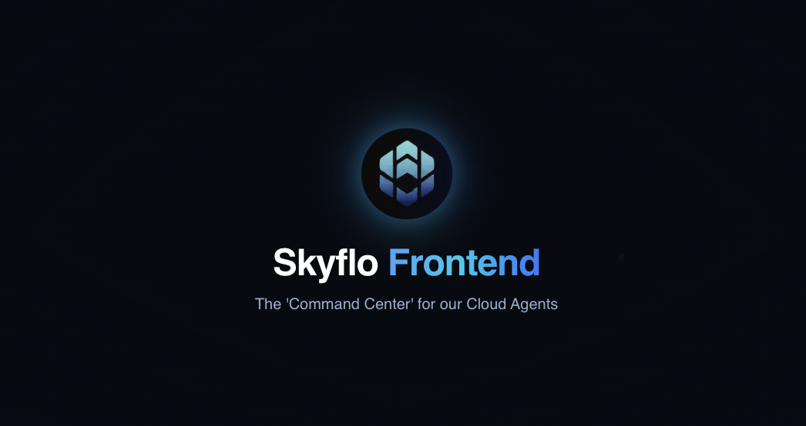

# Frontend

<p align="center">
  
</p>

<div align="center">

  [](https://skyflo.ai)
  [](https://discord.gg/kCFNavMund)
  [](https://x.com/skyflo_ai)
  [](https://www.youtube.com/@SkyfloAI)
  [](LICENSE)
  
</div>

## Command Center for AI-powered Cloud Agents

The Skyflo Frontend serves as the primary user interface for our platform, providing an intuitive and powerful command center for interacting with AI agents that manage cloud resources. Built with modern web technologies, it offers a seamless experience for cloud management through natural language.

## Key Features

- **Conversational Cloud Management**: Natural language interface for AWS and Kubernetes operations
- **Resource Visualization**: Intuitive dashboards for cloud resource monitoring
- **Agent Configuration**: Easy setup and management of cloud agents
- **Interactive Workflows**: Guided processes for common cloud operations
- **Real-time Updates**: Live notifications of cloud resource changes
- **Responsive Design**: Optimized experience across desktop and mobile devices

## Architecture

The Frontend consists of several core components:

- **Chat Interface**: Conversational AI interactions for cloud operations
- **Resource Explorer**: Visual browsing and management of cloud resources
- **Agent Dashboard**: Configuration and monitoring of deployed agents
- **User Management**: Authentication, authorization, and team settings
- **Notification System**: Real-time alerts and status updates

## Tech Stack

- **Framework**: Next.js 14, React 18
- **Language**: TypeScript
- **Styling**: Tailwind CSS
- **State Management**: React Context/Redux
- **API Integration**: Axios, SWR
- **UI Components**: Headless UI, Radix UI
- **Monitoring**: Sentry, Google Analytics

## Getting Started

### Prerequisites

- Node.js 18+
- Yarn package manager
- Skyflo Backend server (API)

### Local Development Setup

1. Clone the repository:
   ```bash
   git clone https://github.com/skyflo-ai/frontend.git
   cd frontend
   ```

2. Install dependencies:
   ```bash
   yarn install
   ```

3. Set up environment variables:
   ```bash
   cp .env.example .env.local
   # Edit .env.local with your configuration
   ```

4. Start the development server:
   ```bash
   yarn dev
   ```

5. Open your browser and navigate to:
   ```
   http://localhost:3000
   ```

## Deployment

### Production Build

```bash
yarn build
yarn start
```

### Docker Deployment

```bash
docker build -t skyflo-frontend .
docker run -p 3000:3000 skyflo-frontend
```

## Contributing

We welcome contributions! Please see our [Contributing Guide](CONTRIBUTING.md) for details.

### Development Process

1. Fork the repository
2. Create your feature branch (`git checkout -b feature/amazing-feature`)
3. Commit your changes (`git commit -m 'Add amazing feature'`)
4. Push to the branch (`git push origin feature/amazing-feature`)
5. Open a Pull Request

## License

This project is licensed under the Business Source License 1.1 - see the [LICENSE](LICENSE) file for details.

## Community

- [Discord](https://discord.gg/kCFNavMund)
- [Twitter/X](https://x.com/skyflo_ai)
- [YouTube](https://www.youtube.com/@SkyfloAI)
- [GitHub Discussions](https://github.com/skyflo-ai/skyflo/discussions)

## Support

- Documentation: [docs.skyflo.ai](https://docs.skyflo.ai)
- Issues: [GitHub Issues](https://github.com/skyflo-ai/frontend/issues)
- Enterprise Support: [enterprise@skyflo.ai](mailto:enterprise@skyflo.ai)
